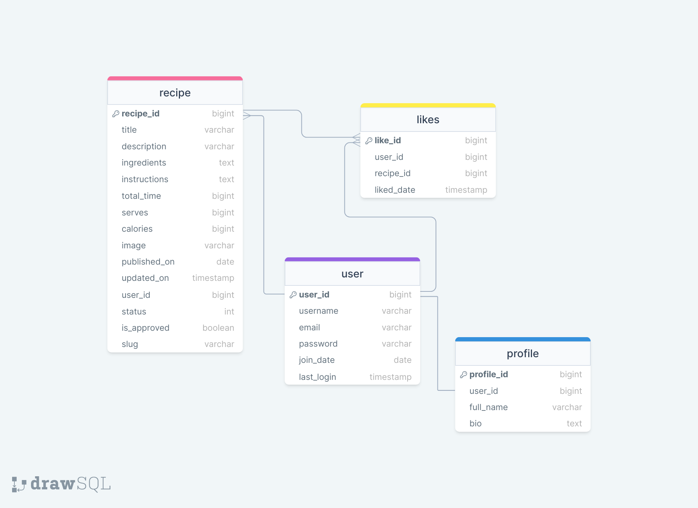

# **The Vegan Archive**

 

 

Step into the world of The Vegan Archive, where we embrace plant-based cuisine as more than just a diet – it's a lifestyle centered around compassion, sustainability, and the pure delight of crafting and relishing delicious dishes that nourish both you and the planet.

Our platform was born from a deep love for plant-based cooking and a vision to unite like-hearted individuals who share a passion for wholesome, flavorful food. Whether you're an experienced vegan chef or embarking on your plant-based journey, The Vegan Archive warmly invites you to uncover, experiment, and broaden your culinary horizons with us. Come join us and celebrate mindful and delicious cooking!

## **USER EXPERIENCE (UX)**

### **User Stories**

Unregistered site user:

- As a user, I can easily navigate through the homepage so that I can understand the main purpose of the website.
- As a user, I can browse a selection of featured recipes so that I can get a taste of what the website offers.
- As a user, I can read an “About us” statement so that I can comprehend the website's main goal and dedication.
- As a user, I can view and follow the recipe so that I can recreate it accurately without encountering confusion or difficulty.
- As a user, I can access the "Sign-up" page if I'm interested in creating an account and becoming part of the community.

Registered site user:

- As a user, I can utilise the same website features as unregistered site users.
- As a user, I can login with my credentials so that I can access my profile, liked recipes, and submissions.
- As a user, I can recover my account access if I have forgotten my password.
- As a user, I can review and edit the information I provided in my user profile and view details about my account activity and engagement on the platform.
- As a user, I can save and store recipes that appeal to me in a designated page.
- As a user, I can remove saved recipes.
- As a user, I can create and manage my own recipes in a designated page so that I can share my culinary creations with the community.

Site admin/Superuser:

- As admin, I can utilise the same website features as unregistered and registered site users.
- As admin, I can access the admin dashboard so that I can manage and oversee all aspects of the website's content and user activity.
- As admin, I can approve or reject recipe submissions before they are published so that I can ensure content quality and adherence to guidelines.
- As admin, I can edit and update recipes submitted by users so that I can correct any errors, improve formatting, or enhance clarity.

### **Agile Methodology**

To strategize the project's development and execution, an Agile Tool in the form of a project Kanban board was employed via Github. The project board utilized issues represented as 'User Stories'. You can access the board through this [link](https://github.com/users/IanaLois/projects/3).

### **The Scope**

#### **The Site's Main Goals:**

- To provide users with a user-friendly and positive experience when using GT Modellista.
- To provide users with a clear understanding of the site's purpose.
- To provide controlled functionality based on a user's permissions.
- To provide user's with a profile that allows them to manage their own content.
- To provide users with a user-friendly and intuitive experience while navigating the website.
- To clearly communicate the purpose and mission of the website to users.
- To implement controlled access and functionality based on user permissions, ensuring a secure and personalized experience.
- To offer users the ability to create and manage their own profiles, enabling them to control their content and engagement on the platform.
- To showcase a diverse range of high-quality vegan recipes and culinary creations.
- To foster a sense of community and engagement among users, encouraging sharing and interaction.
- To serve as a platform for learning and exploring vegan cooking, promoting sustainability, health, and ethical living.
- To allow users to save, organize, and manage their favorite recipes for easy access.
- To empower site administrators to manage and oversee all aspects of content, user activity, and interactions.

## **DESIGN**

### **Colors**

Color Palette

 

 

The color scheme for this project was obtained from [Coolors](https://coolors.co/).
It is a combination of earthy and calming tones:

- #f4f0bb has a warm and soft beige tone reminiscent of sandy beaches or natural fibers. This color exudes comfort and relaxation.
- #1C7866 has a deep and rich green resembling lush vegetation. This color brings a sense of balance and tranquility.

The harmonious interaction of these colors creates a natural connection and a tranquil ambiance, making them suitable for this project that aims to communicate feelings of wellness and unity.

### **Typography**

[Google Fonts](https://fonts.google.com/) was used to generate the font family "Hind" and in the event that it doesn't load, it will default to "sans-serif".

The "Hind" font family was chosen for the entire project because it strikes a good balance between being easy to read, adaptable, and visually pleasing. The clear letter shapes ensure that text is easy to understand. The font comes in different weights, which helps organize headings and text effectively.

Hind's modern yet elegant look matches the project's style well and by using Hind consistently, a cohesive look and feel is created, which makes the project user-friendly and visually appealing.

### **Media**

- [DrawSQL](https://drawsql.app/diagrams) was used to design the database diagram.
- [Balsamiq](https://balsamiq.com/) was used to create the wireframes.
- Project images were sourced from [Pexels](https://www.pexels.com/) and [Freepik](https://www.freepik.com/).

### **Database**

Database Diagram

 

 

### **Wireframes**

Homepage

 

 

Directory Page

 

 

Recipe Layout

 

 

Login Page

 

 

Sign-up Page

 

 

Password Reset Page

 

 

Login Alert

 

 

User Dropdown

 

 

User Profile Page

 

 

Likes Page

 

 

Submissions Page

 

 

Submission Draft Page

 

 

Logout Alert

 

 
