# **The Vegan Archive**

 

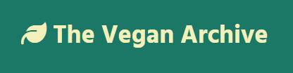

 

 

## **TABLE OF CONTENTS**

- [**The Vegan Archive**](#the-vegan-archive)
  - [**TABLE OF CONTENTS**](#table-of-contents)
  - [**INTRODUCTION**](#introduction)
  - [**USER EXPERIENCE (UX)**](#user-experience-ux)
    - [**User Stories**](#user-stories)
  - [**AGILE METHODOLOGY**](#agile-methodology)
  - [**THE SCOPE**](#the-scope)
    - [**The Site's Main Goals**](#the-sites-main-goals)
  - [**DESIGN**](#design)
    - [**Colours**](#colours)
    - [**Typography**](#typography)
  - [**DATABASE SCHEMA**](#database-schema)
  - [**WIREFRAMES**](#wireframes)
  - [**FEATURES**](#features)
    - [**Full Home Page**](#full-home-page)
    - [**Navigation Bar**](#navigation-bar)
    - [**User Dropdown**](#user-dropdown)
    - [**Carousel and Intro Text**](#carousel-and-intro-text)
    - [**About us**](#about-us)
    - [**Footer**](#footer)
  - [**DEPLOYMENT**](#deployment)
    - [**Version Control**](#version-control)
    - [**Heroku Deployment**](#heroku-deployment)
  - [**CREDITS**](#credits)
    - [**Technology used**](#technology-used)
    - [**Media**](#media)

 

 

## **INTRODUCTION**

Step into the world of The Vegan Archive where we embrace plant-based cuisine as more than just a diet. It's a lifestyle centered around compassion, sustainability, and the pure delight of crafting and relishing delicious dishes that nourish both you and the planet.

Our platform was born from a deep love for plant-based cooking and a vision to unite like-hearted individuals who share a passion for wholesome, flavourful food. Whether you're an experienced vegan chef or embarking on your plant-based journey, The Vegan Archive warmly invites you to uncover, experiment, and broaden your culinary horizons with us. Come join us and celebrate mindful and delicious cooking!

 

 

## **USER EXPERIENCE (UX)**

### **User Stories**

Unregistered site user:

- As a user, I can easily navigate through the homepage so that I can understand the main purpose of the website.
- As a user, I can have a quick glance of sample recipes in a carousel format so that I can be persuaded to browse and explore the recipes the website has to offer.
- As a user, I can read an “About us” statement so that I can comprehend the website's main goal and dedication.
- As a user, I can access the "Directory" page and view the website's featured recipes written by members of the community so that I can be easily inspired by the recipes and have an overview of the recipe's serving portions, calories, and the cooking time.
- As a user, I can view and follow the recipe so that I can recreate it accurately without encountering confusion or difficulty.
- As a user, I can access the "Sign-up" page if I'm interested in creating an account and becoming part of the community.

Registered site user:

- As a user, I can utilise the same website features as unregistered site users so that I can explore and navigate the content seamlessly.
- As a user, I can log in with my credentials so that I can access my profile, liked recipes, and submissions efficiently.
- As a user, I can select the "Remember Me" checkbox during the log in process so that I can stay logged in on the device I'm currently using and providing a convenient and coherent experience when returning to the website.
- As a user, I can recover my account access if I have forgotten my password so that I can regain entry to my personalised content.
- As a user, I can receive a clear and user-friendly notification confirming my successful login status so that I'm promptly informed about the successful authentication.
- As a user, I can review and edit the information I provided in my user profile and view details in the about my account activity and engagement on the platform in the "User Profile" page so that I can maintain accurate and up-to-date personal information.
- As a user, I can save and store recipes that appeal to me in a "Likes page" so that I can easily access and reference them later.
- As a user, I can remove saved recipes so that I can manage my saved content according to my preferences.
- As a user, I can save and store my own recipe drafts in the "My Recipe Submissions" page so that I can edit or delete drafts before sharing them with the community and contributing to the platform's content.
- As a user, I can easily edit my recipe and save the changes that have been made by following the required contents to be completed, such as the recipe name, recipe picture, description, serving portions, calories, cooking time, ingredients checklist and the numbered instructions.
- As a user, I can receive a confirmation dialog asking "Are you sure you want to log out?" and when "Yes" is chosen, a successful logout alert appears so that accidental logouts can be prevented and assurance is provided that the session has ended securely.

Site admin/Superuser:

- As admin, I can utilise the same website features as unregistered and registered site users so that I can experience the platform from the perspective of different user roles.
- As admin, I can access the admin dashboard so that I can efficiently manage and oversee all aspects of the website's content and user activity and ensuring a seamless and well-monitored platform.
- As admin, I can approve or reject recipe submissions before they are published so that I can maintain content quality, uphold community guidelines and provide users with a curated and reliable collection of recipes.

 

 

## **AGILE METHODOLOGY**

To strategise the project's development and execution, an Agile Tool in the form of a project Kanban board was employed via Github. The project board utilised issues represented as "User Stories". You can access the board through this [link](https://github.com/users/IanaLois/projects/3).

 

 

## **THE SCOPE**

### **The Site's Main Goals**

1. **Clear Purpose:** Communicate the site's mission to foster a connection with users.

2. **Personalised Experience:** Provide users with tools for efficient content management and personalisation.

3. **User-Friendly Design:** Deliver an intuitive and user-friendly interface for seamless navigation.

4. **Secure Access:** Implement controlled access for a secure and personalised user experience.

5. **Community Building:** Cultivate engagement and encourage users to share culinary experiences.

6. **Diverse Culinary Showcase:** Highlight a variety of top-tier vegan recipes to inspire culinary exploration.

7. **Promoting Values:** Advocate for sustainability, health, and ethical living in vegan cooking.

8. **Efficient Recipe Management:** Facilitate easy saving, organising and management of favourite recipes for users.

9. **Administrative Oversight Tools:** Equip site administrators with powerful tools for effective community management to ensure the continual flourishing of the online community.

 

 

## **DESIGN**

### **Colours**

 

Colour Palette

 

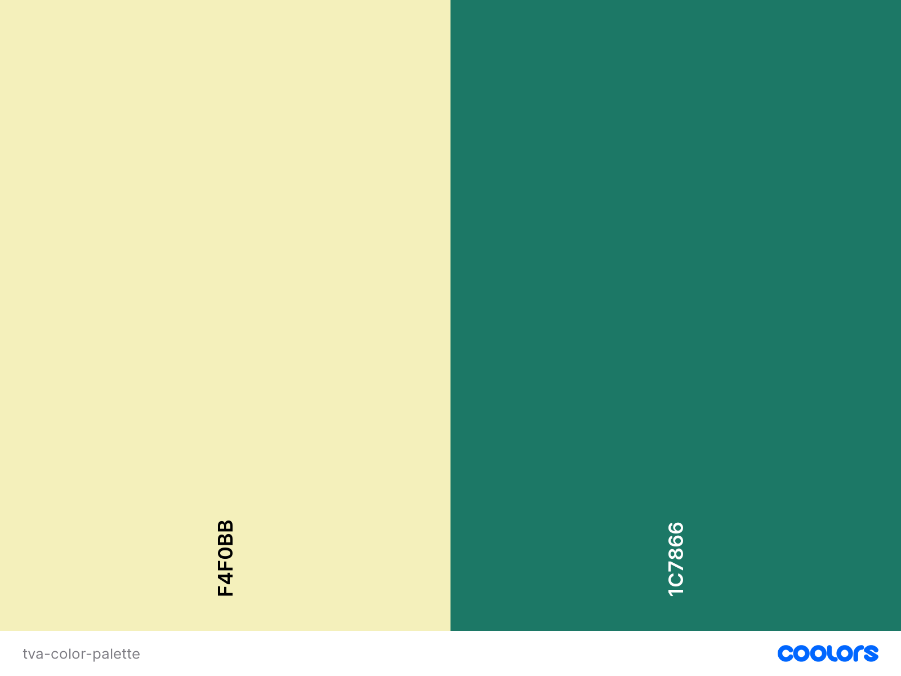

 

The colour scheme for this project was obtained from [Coolors](https://coolors.co/).
It is a combination of earthy and calming tones:

- #f4f0bb has a warm and soft beige tone reminiscent of sandy beaches or natural fibers. This color exudes comfort and relaxation.
- #1C7866 has a deep and rich green resembling lush vegetation. This color brings a sense of balance and tranquility.

The harmonious interaction of these colours creates a natural connection and a tranquil ambiance, making them suitable for this project that aims to communicate feelings of wellness and unity.

 

### **Typography**

[Google Fonts](https://fonts.google.com/) was used to generate the font family "Hind" and in the event that it doesn't load, it will default to "sans-serif".

- The "Hind" font family was chosen for the entire project because it strikes a good balance between being easy to read, adaptable, and visually pleasing. The clear letter shapes ensure that the text is easy to understand. The font comes in different weights which helps organise headings and text effectively.

Hind's modern yet elegant look matches the project's style well and by using Hind consistently, a cohesive look and feel is created, making the project user-friendly and visually appealing.

 

 

## **DATABASE SCHEMA**

 

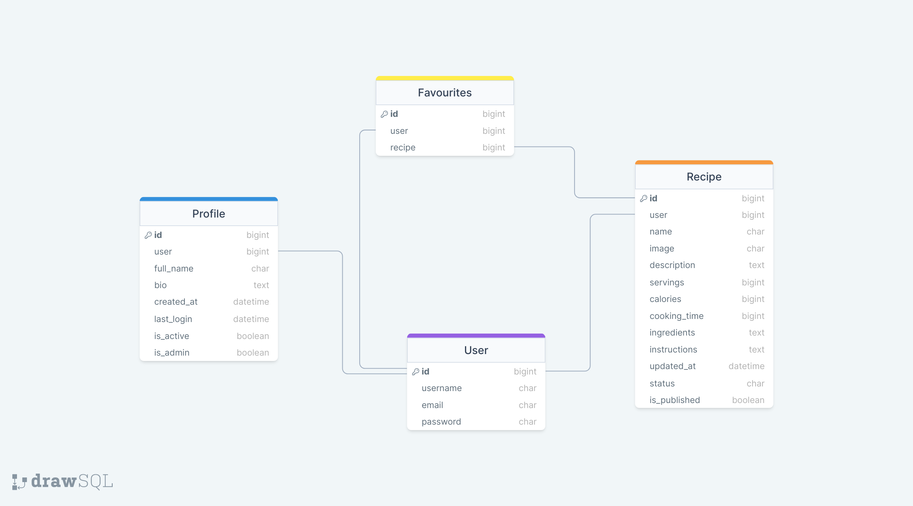

 
 

|       **User**            |                   |                            |
|:---------------------:|:-----------------:|:--------------------------:|
|           |      **Field**        |          **Type**              |
|                       |     username      |        CharField           |
|                       |       email       |        EmailField          |
|                       |      password     |        CharField           |

 

|       **Profile**          |                   |                            |
|:----------------------:|:-----------------:|:--------------------------:|
|            |      **Field**        |          **Type**              |
|           OneToOneField              |        user       |                 |
|                         |     full_name     |        CharField           |
|                         |        bio        |        TextField           |
|                         |     created_at    |      DateTimeField         |
|                         |     last_login    |      DateTimeField         |
|                         |     is_active     |      BooleanField          |
|                         |      is_admin     |      BooleanField          |

 

|        **Recipe**          |                   |                            |
|:----------------------:|:-----------------:|:--------------------------:|
|            |      **Field**        |          **Type**              |
|           ForeignKey              |        user       |                 |
|                         |       title       |        CharField           |
|                         |       image       |        CloudinaryField           |
|                         |    description    |        TextField           |
|                         |      servings     |    PositiveIntegerField         |
|                         |      calories     |    PositiveIntegerField         |
|                         |   cooking_time    |    PositiveIntegerField         |
|                         |    ingredients    |        TextField           |
|                         |   instructions    |        TextField           |
|                         |    created_at     |      DateTimeField         |
|                         |    updated_at     |      DateTimeField         |
|                         |       status      |        IntegerField           |
|                         |   is_approved    |      BooleanField          |
|           ManyToManyField              |   likes    |                |

 

|      **Likes**        |                   |                            |
|:----------------------:|:-----------------:|:--------------------------:|
|            |      **Field**        |          **Type**              |
|ForeignKey|      user        |                 |
|            ForeignKey             |      recipe       |                 |

 

 

 

## **WIREFRAMES**

Homepage

 

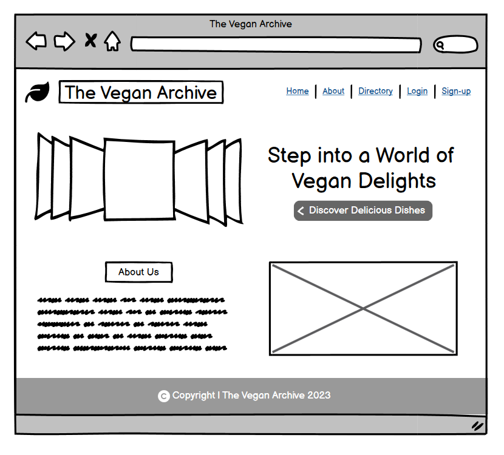

 

Directory Page

 

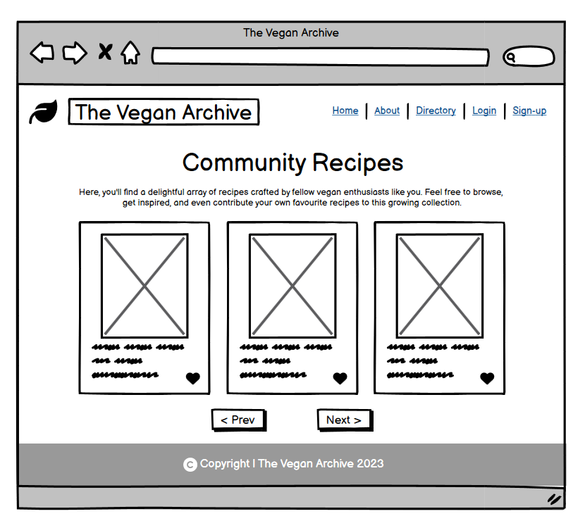

 

Recipe Layout

 

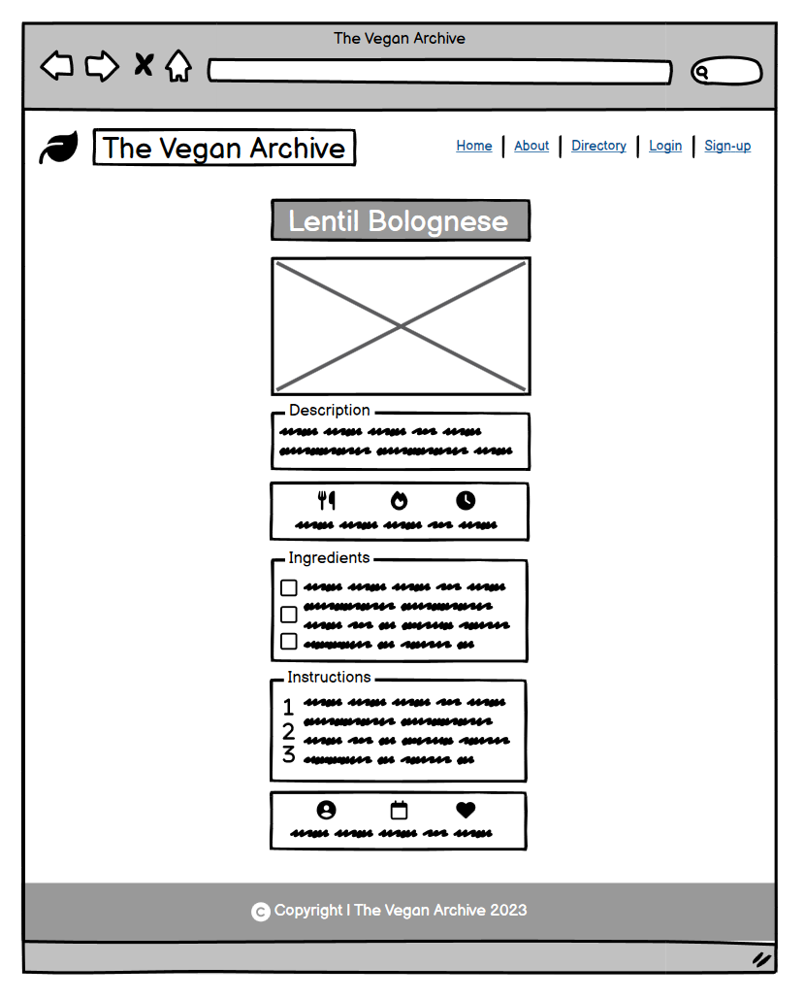

 

Login Page

 

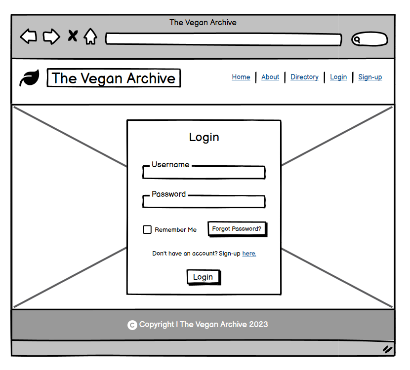

 

Sign-up Page

 

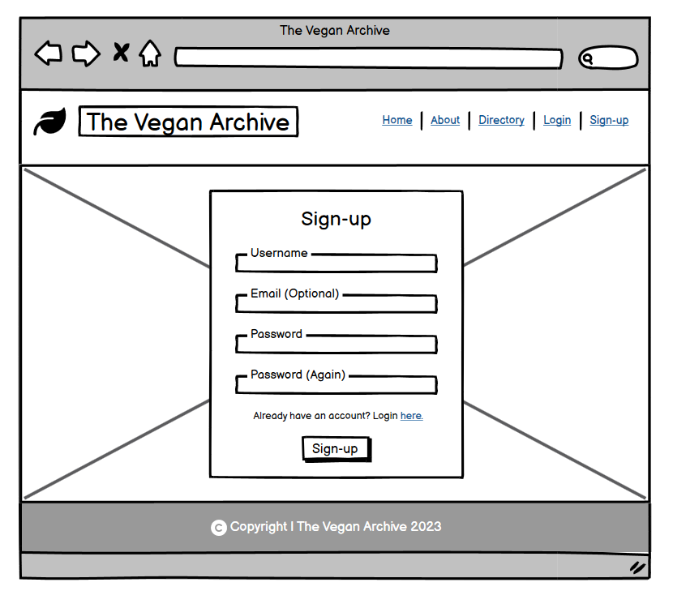

 

Password Reset Page

 

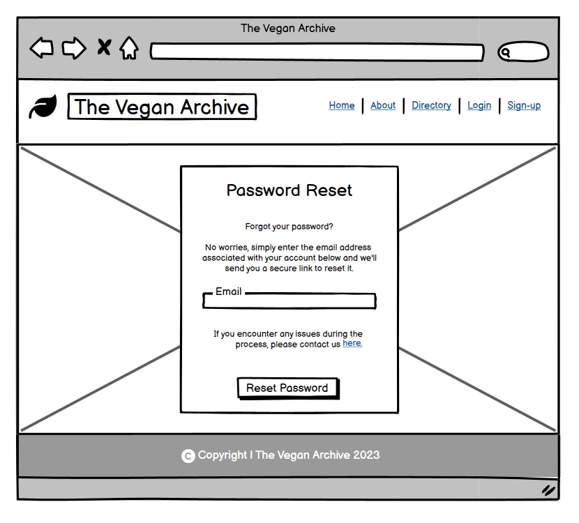

 

Login Alert

 

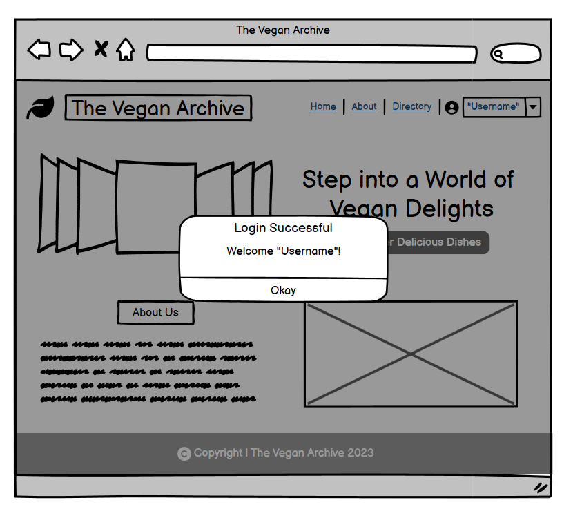

 

User Dropdown

 

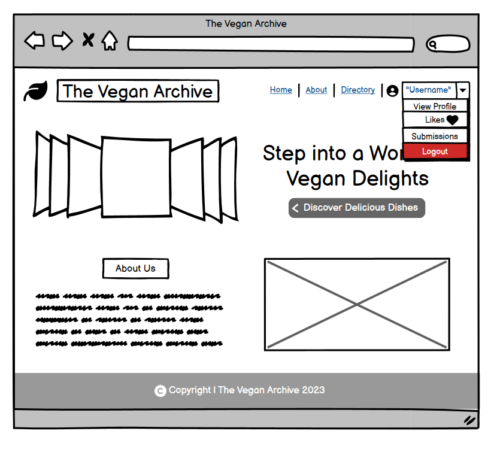

 

User Profile Page

 

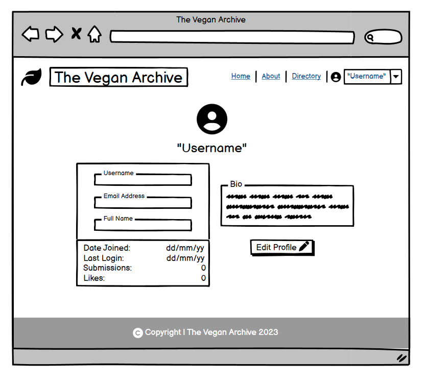

 

Likes Page

 

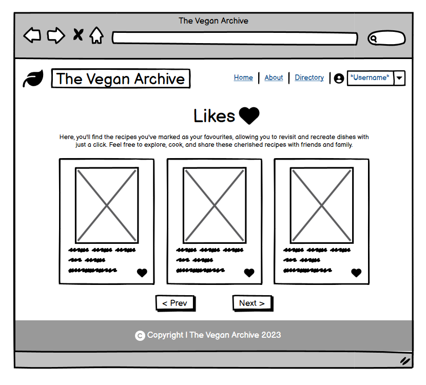

 

Submissions Page

 

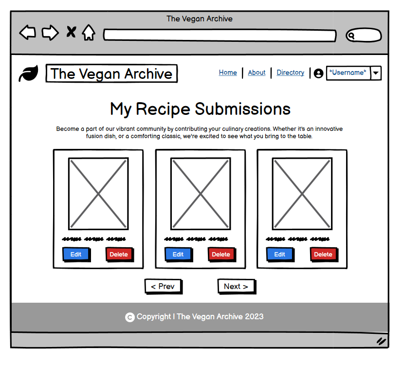

 

Submission Draft Page

 

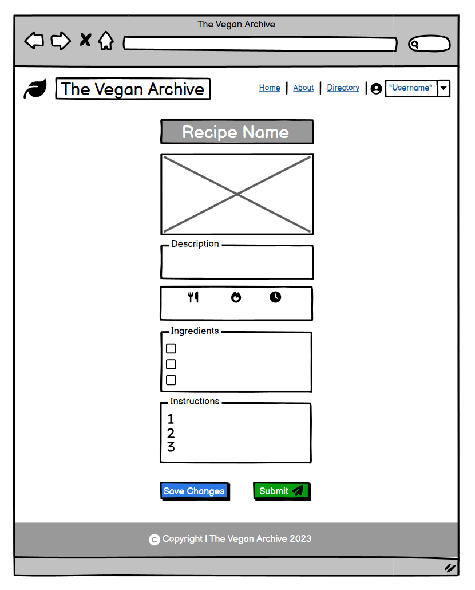

 

Logout Alert

 

 

 

## **FEATURES**

### **Full Home Page**

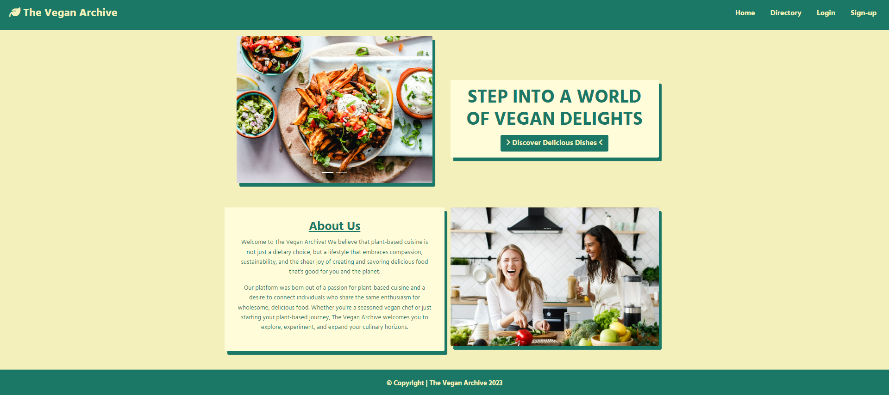

### **Navigation Bar**

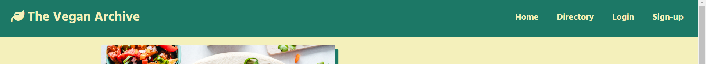

 

- Positioned at the top with a "sticky" attribute for easy access while scrolling.
- Offers links to key sections: Home, Directory, Login, and Sign-up.
- Provides quick return to the main landing page by clicking the main logo or "Home" link.

### **User Dropdown**

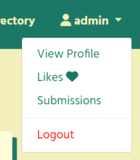

 

- Offers a clear and concise display of options available to registered users: View Profile, Likes, Submissions, and a distinct red "Logout" link.

### **Carousel and Intro Text**

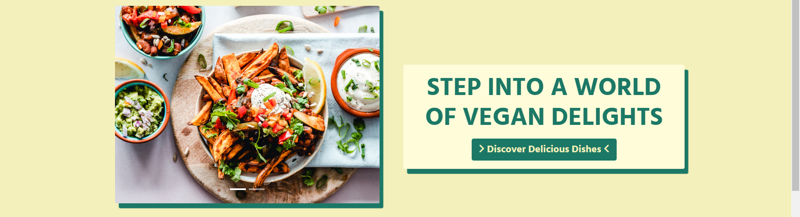

 

- Features a dynamic carousel showcasing a variety of enticing vegan dishes.
- Welcomes users with a captivating and friendly message.
- Incorporates an eye-catching button beneath the text.

### **About us**

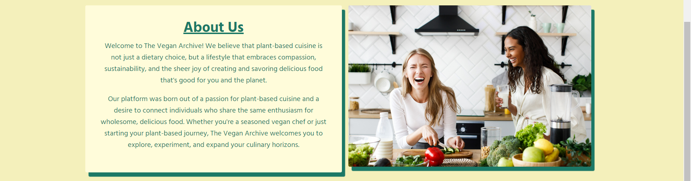

 

- Presents essential details about the platform's purpose and values.
- Image showcases a joyful and engaging atmosphere.
- Symbolises the spirit of community and collaboration around vegan cooking.

### **Footer**

 

- Showcases a straightforward copyright notice.

 

 

## **DEPLOYMENT**

### **Version Control**

The Vegan Archive was created using [Codeanywhere](https://codeanywhere.com/) and pushed to [GitHub](https://github.com/).

- ``git status`` command was used to display the status of changes as untracked, modified, or staged in the working directory and staging area.

- ``git add .`` command was used to stage all changes in the working directory and its subdirectories for the next commit.

- ``git commit -m “commit message”`` command was used to create a new commit in the Git repository with a specified commit message.

- ``git push`` command was used to upload local repository content to a remote repository.

 

### **Heroku Deployment**

**Requirement and Procfile**

- ``pip3 freeze --local > requirements.txt`` command was used to create a ``requirements.txt`` file.
- A new file named ``Procfile`` was created and a line of code ``web: gunicorn theveganarchive.wsgi`` was added.
- Then everything was pushed to the repository.

**Creating the Heroku App**

- Navigate to the Dashboard after logging into [Heroku](https://www.heroku.com/).
- Select **"New"** and then **"Create new app".**
- Name the app and then select the closest region.
- Click **"Create app"** to confirm.

**Creating the Database**

- Navigate to the Dashboard after logging into [ElephantSQL](https://www.elephantsql.com/).
- Select **"Create New Instance".**
- Choose the **Tiny Turtle (Free)** plan and **Name** it, leaving the **Tags** section blank.
- Click **"Select Region"** and select the closest data center.
- Click **"Review".**
- If all details are correct, select **"Create instance".**
- Return to the Dashboard and click on the **database instance name** of the project.
- In the URL section, copy the database URL.
- Ensure that Django and Gunicorn are installed in your workspace by executing the command ``pip3 install Django==3.2.3`` and ``pip3 install gunicorn==21.2.0``.
- Similarly, confirm the installation of the database infrastructure by running ``pip3 install dj-database-url==0.5.0`` and ``pip3 install psycopg2==2.9.7``
- Then ``pip freeze > requirements.txt`` command was used to update the requirements.txt file.

**Setting up Cloudinary**

- Go to the website.
- Click on the **"Sign Up For Free"** button.
- Fill in your name, email address, and choose a password.
- For **Primary interest**, select **"Programmable Media" for image and video API**.
- Click **"Create Account."**
- Verify your email, and you will be directed to the dashboard.

**The env.py file**

- A ``env.py`` file must be present in the working directory and included in the ``.gitignore`` file.
- At the top of the ``env.py`` file, add the line of code ``import os``.
- Below that add the following lines:

  ``os.environ["DATABASE_URL"] = "copied URL from ElephantSQL database"``  
  ``os.environ["SECRET_KEY"] = "create a secret key of your own or use a random key generator"``  
  ``os.environ["CLOUD_NAME"] = "from the copied API Environment Variable found in Cloudinary account dashboard, use the characters AFTER @ "``  
  ``os.environ["API_KEY"] = "from the copied API Environment Variable found in Cloudinary account dashboard, use the characters AFTER CLOUDINARY_URL=cloudinary:// and BEFORE the : "``  
  ``os.environ["API_SECRET"] = "from the copied API Environment Variable found in Cloudinary account dashboard, use the characters AFTER : and BEFORE @ "``  

- Import the environment variables into the ``settings.py`` file.
- Then run ``python3 manage.py migrate`` in the terminal window to migrate the data structure to the database instance.

**Heroku Config Vars**

- Navigate to the Heroku Dashboard and select the **"Settings"** tab in the app that was just created.
- Click **"Reveal Config Vars"**.
- Add the following:  

  ``DATABASE_URL`` - ``copied database URL from ElephantSQL``  
  ``SECRET_KEY`` - ``copied secret key``  
  ``CLOUDINARY`` - ``copied API Environment Variable AFTER CLOUDINARY_URL=``  
  ``DISABLE_COLLECTSTATIC`` - ``1``  

**Connecting to GitHub and Deploy**

- Navigate to the Heroku Dashboard and select the **"Deploy"** tab in the app that was just created.
- Choose GitHub as the preferred deployment method.
- Locate the project repository by name and click **"Connect"** to establish the connection.
- Select **"Enable Automatic Deploys"** if desired.
- Lastly, select **"Deploy Branch"** to initiate the deployment process and observe the app being built.

 

 

## **CREDITS**

### **Technology used**

- [Codeanywhere](https://codeanywhere.com/) was used for creating the full project in a cross-platform cloud IDE.
- [Git](https://git-scm.com/) was used for version control in the project.
- [GitHub](https://github.com/) was used for hosting and collaborating on the Git repositories created with Codeanywhere and Git.
- [Heroku](https://www.heroku.com/) was used for deploying, scaling, and managing applications in the cloud.
- [ElephantSQL](https://www.elephantsql.com/) was used for managing PostgreSQL databases in the cloud.
- [miniWebtool](https://miniwebtool.com/django-secret-key-generator/) was used to generate a random secret key.
- [Cloudinary](https://cloudinary.com/) was used for managing and optimising media assets in the cloud.
- [Coolers](https://coolors.co/) was used for the project's colour scheme.
- [Google Fonts](https://fonts.google.com/) was used for the project's text font.
- [DrawSQL](https://drawsql.app/diagrams) was used to design the database diagram.
- [Balsamiq](https://balsamiq.com/) was used to create the wireframes.
- [WhiteNoise](https://whitenoise.readthedocs.io/en/latest/index.html) was used to serve the static files.

### **Media**
- Project images were sourced from [Pexels](https://www.pexels.com/) and [Freepik](https://www.freepik.com/).

Back to [top](#table-of-contents)
